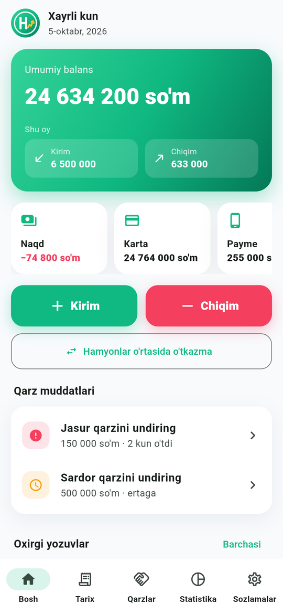
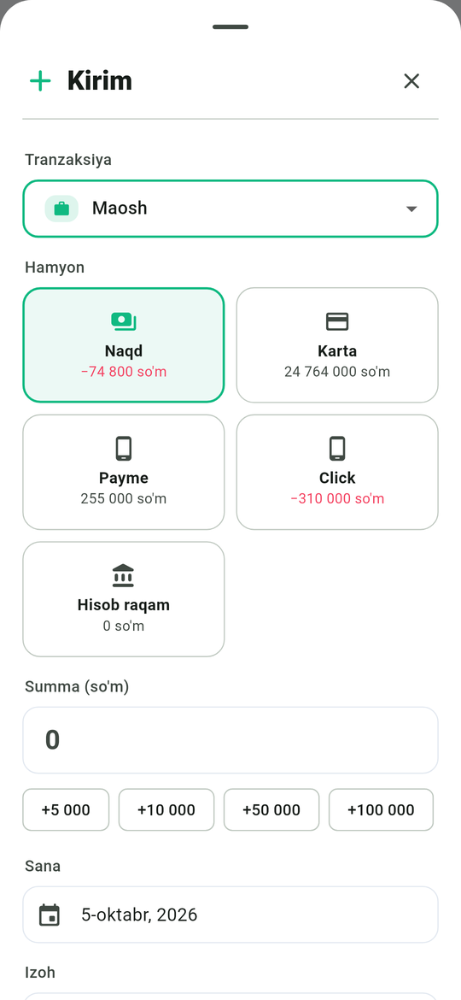
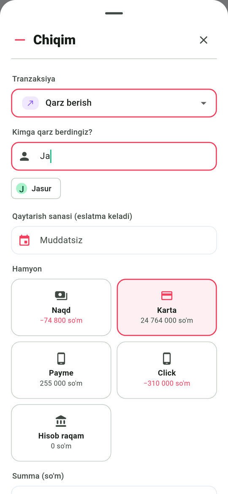
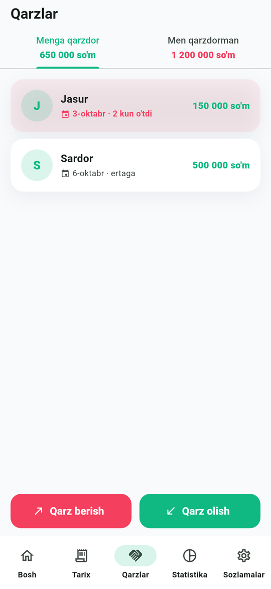
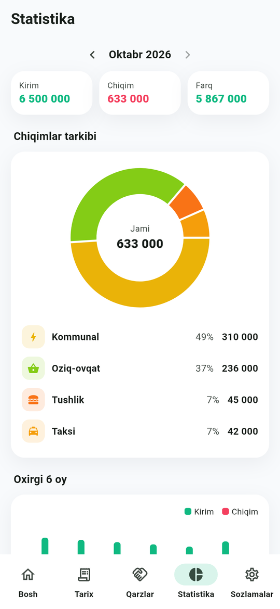
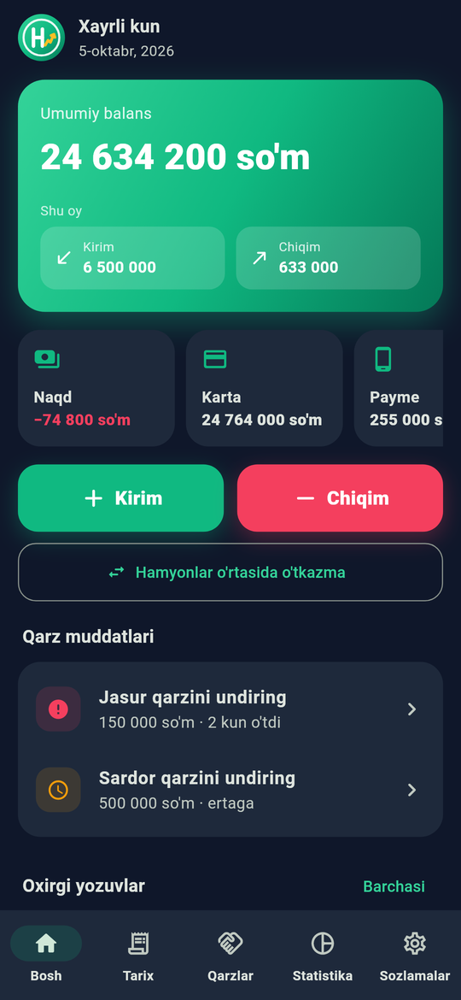

# Hisobchi

Shaxsiy moliya uchun Android ilova: kirim, chiqim, hamyonlar, qarzlar va eslatmalar.
To'liq oflayn — internet, server yoki akkaunt kerak emas. Til: o'zbek (lotin).

<p>
  
  
  
  
</p>
<p>
  
  
  
</p>

## Imkoniyatlar

- **Kirim va chiqim faqat tranzaksiya turlari orqali.** Standart turlar: Maosh, Taksi, Tushlik,
  Oziq-ovqat, Kommunal va boshqalar. Foydalanuvchi o'z turini (nom, ikonka, rang) qo'shadi —
  to'g'ridan-to'g'ri formadagi "Yangi tur qo'shish" orqali ham.
- **Qarzlar.** Kirimda: *Qarz olish*, *Qarzni qaytarib olish*. Chiqimda: *Qarz berish*,
  *Qarzni qaytarish*. Qarz turi tanlansa ilova **kimligini so'raydi** (avvalgi odamlar taklif
  qilinadi) va **qaytarish sanasini** belgilash mumkin.
- **Eslatmalar.** Muddat kuni soat 09:00 da: *"Bugun Alidan 100 000 so'm qarzni undirish kuni"* yoki
  *"Bugun Aliga 100 000 so'm qarzingizni qaytarish kuni"*. Ixtiyoriy — bir kun oldin ham.
  Qisman qaytarilgan qarzda qolgan summa aytiladi; to'liq qaytarilgani eslatilmaydi.
- **Hamyonlar:** Naqd, Karta, Payme, Click, Hisob raqam (+ o'zingiznikini qo'shish), o'tkazmalar.
- **Statistika:** chiqimlar tarkibi (donut), 6 oylik kirim/chiqim, oylik byudjetlar.
- Splash animatsiyasi va logo, kunduz/tun mavzusi, JSON zaxira nusxa (eksport/import).

Qarz va o'tkazmalar daromad/xarajat statistikasiga kirmaydi — ular faqat hamyon balansini o'zgartiradi.

## APK olish

Har bir push'da GitHub Actions APK quradi: **Actions → APK → oxirgi ishga tushirish →
Artifacts → `hisobchi-apk`**. Faylni telefonga yuklab o'rnating (noma'lum manbalardan
o'rnatishga ruxsat bering). Minimal Android 7.0.

Mahalliy qurish:

```bash
flutter pub get
flutter build apk --release
# build/app/outputs/flutter-apk/app-release.apk
```

## Ishlab chiqish

```bash
flutter test                                    # unit + widget testlar
dart run build_runner build                     # drift kodi (lib/data/database.g.dart)
flutter test tool/screenshots/screenshots_test.dart --update-goldens   # skrinshotlar
flutter test tool/icons/generate_icons_test.dart                       # ilova ikonkalari
```

Tuzilma:

| Papka | Vazifasi |
|---|---|
| `lib/domain/` | Sof hisob-kitob: balans, qarz qoldig'i (FIFO), byudjet, statistika, eslatma rejasi |
| `lib/data/` | Drift (SQLite) baza, standart ma'lumot, repozitoriy, zaxira nusxa |
| `lib/features/` | Ekranlar: splash, bosh, kirim/chiqim oynasi, o'tkazma, tarix, qarzlar, statistika, sozlamalar |
| `lib/core/` | Mavzu, formatlash (`117 200 so'm`), ikonkalar, eslatma servisi |
| `lib/state/` | Riverpod provayderlari |

Dizayn spetsifikatsiyasi: [`docs/2026-10-05-hisobchi-v1-design.md`](docs/2026-10-05-hisobchi-v1-design.md).
v2 da AI (matn, ovoz, chek) `TransactionDraft` orqali formaga ulanadi.
